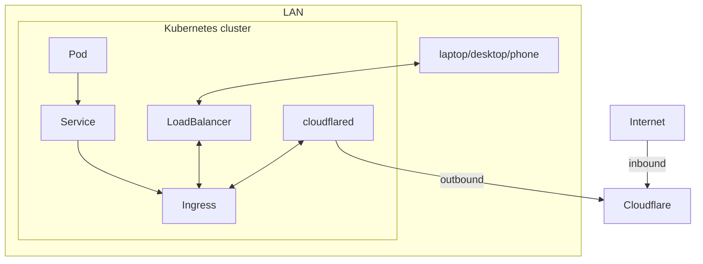

# Networking

## Architecture



## Traffic Flow

**Local Access:**
```
Client → Cilium LoadBalancer → Ingress → Service → Pod
```

**External Access:**
```
Internet → Cloudflare → cloudflared → Ingress → Service → Pod
```

## Components

### Cilium LoadBalancer
- **Implementation**: `ciliumloadbalancerippools.cilium.io`
- **IP Pool**: Managed IP addresses for LoadBalancer services
- **Features**: eBPF-based load balancing, DSR support

```yaml
apiVersion: cilium.io/v2alpha1
kind: CiliumLoadBalancerIPPool
metadata:
  name: default-pool
spec:
  cidrs:
  - cidr: "192.168.1.100/32"
  - cidr: "192.168.1.101/32"
  - cidr: "192.168.1.102/32"
  serviceSelector:
    matchLabels:
      io.cilium.service: "true"
```

### Ingress Controller
- **SSL Termination**: cert-manager + Let's Encrypt
- **Routing**: Path and host-based routing
- **Security**: Rate limiting, authentication

### Cloudflare Tunnel
- **Purpose**: Secure external access without port forwarding
- **Implementation**: cloudflared daemon in cluster
- **Security**: Zero-trust network access

## Security

- **Network Policies**: CiliumNetworkPolicy for Pod-to-Pod traffic control
- **TLS Encryption**: cert-manager + Let's Encrypt for HTTPS
- **Zero-trust Access**: Cloudflare Tunnel for external access
- **DDoS Protection**: Cloudflare edge security

## Troubleshooting

```bash
# Check LoadBalancer IP pools
kubectl get ciliumloadbalancerippools

# Check LoadBalancer services
kubectl get services --field-selector spec.type=LoadBalancer

# Cilium debugging
kubectl exec -n kube-system ds/cilium -- cilium status
kubectl exec -n kube-system ds/cilium -- cilium service list
kubectl exec -n kube-system ds/cilium -- cilium bpf lb list

# Check ingress
kubectl describe ingress

# Test connectivity
kubectl run test-pod --image=busybox --rm -it -- /bin/sh
```
